<div align="left">

# 🔐 idmap-core

### Distributed Key Generation & Threshold Signing Engine for Solana
IdMap-Core is the cryptographic backbone of the IdMap protocol, implementing a secure, production-ready 2-of-2 threshold signature scheme using Ed25519 and the CGGMP21 protocol. It enables two independent parties to jointly generate Solana keypairs and collaboratively sign transactions without ever exposing the complete private key to any single entity — ensuring true non-custodial, trustless transaction security.

*Powered by CGGMP21 DKG and Ed25519 Threshold Signatures*

---

[](https://www.rust-lang.org/)
[](https://tokio.rs/)
[](https://solana.com/)
[](https://redis.io/)
[](LICENSE)

</div>

---

## 📖 Overview

This system implements **multi-party computation (MPC)** for Solana key management, enabling secure wallet creation and transaction signing across distributed nodes without reconstructing private keys.

**Key Features:**
- ✅ 2-of-2 threshold distributed key generation (DKG)
- ✅ Collaborative Ed25519 signature generation
- ✅ TCP-based MPC protocol transport with length-delimited framing
- ✅ Redis Pub/Sub orchestration for session coordination
- ✅ Production-grade async Rust with Tokio
- ✅ Zero private key exposure (keys never fully reconstructed)
- ✅ Modular workspace architecture (library + server + client)

---

## 🌐 Resources & Links

Here are all the key resources related to **IdMap** and its components:

- 🔗 **IdMap Gateway Repository:** [github.com/akash-R-A-J/idmap-gateway](https://github.com/akash-R-A-J/idmap-gateway)
- 📘 **IdMap Core – Detailed Documentation:** [deepwiki.com/akash-R-A-J/idmap-core](https://deepwiki.com/akash-R-A-J/idmap-core)
- 📗 **IdMap Gateway – Detailed Documentation:** [deepwiki.com/akash-R-A-J/idmap-gateway](https://deepwiki.com/akash-R-A-J/idmap-gateway)
- 🚀 **Live Website:** [id-map.shop](https://www.id-map.shop/)

---

## 🏗️ Architecture & Workflow

### 🧩 System Components

<table>
<tr>
<td width="50%">

#### 🖥️ Core Library (dkg_tcp)
- Reusable DKG and signing primitives
- TCP transport layer with async message framing
- Environment configuration loader
- Ed25519 threshold cryptography via `givre` crate

#### ⚙️ Server Binary (NODE_ID=0)
- Accepts incoming TCP connections for MPC protocols
- Listens to Redis `dkg-start` and `sign-start` channels
- Maintains in-memory key share storage per session
- Publishes results to `dkg-result` and `sign-result`

</td>
<td width="50%">

#### 💻 Client Binary (NODE_ID=1)
- Initiates TCP connections to server for protocol execution
- Mirrors server's Redis subscription pattern
- Stores key shares locally in memory
- Coordinates with server via Redis for session management

#### 🔄 Redis Pub/Sub
- External orchestration layer for triggering protocols
- Session-based message routing (`session-001`, `session-002`, etc.)
- Enables stateless coordination between distributed nodes
- Publishes aggregated results back to gateway

</td>
</tr>
</table>

---

### 📝 System Architecture

```
┌─────────────────────────────────────────────────────────────────┐
│                        External Systems                          │
│                    (Gateway Backend / CLI)                       │
└────────────┬──────────────────────────────┬─────────────────────┘
             │                              │
             │  Trigger keygen/signing      │
             ▼                              ▼
    ┌─────────────────────────────────────────────────┐
    │              Redis Pub/Sub Layer                 │
    │  Channels: dkg-start, dkg-result,               │
    │            sign-start, sign-result              │
    └──────────┬──────────────────────┬────────────────┘
               │                      │
               ▼                      ▼
      ┌────────────────┐      ┌────────────────┐
      │  Server (N=0)  │◄────►│  Client (N=1)  │
      │                │ TCP  │                │
      │ Port 7001 DKG  │      │ Connects to    │
      │ Port 7002 Sign │      │ Server Ports   │
      └────────┬───────┘      └────────┬───────┘
               │                       │
               └───────────┬───────────┘
                           ▼
              ┌────────────────────────┐
              │  MPC Protocol Engine   │
              │  - CGGMP21 DKG         │
              │  - Ed25519 Signing     │
              │  - Round-based msgs    │
              └────────────────────────┘
                           │
                           ▼
              ┌────────────────────────┐
              │   Solana Blockchain    │
              │   (Transaction Submit) │
              └────────────────────────┘
```

---

### 🔑 Distributed Key Generation Flow

> **Two parties jointly generate a shared Solana keypair without exposing the full private key**


<details>
<summary><b>📊 Text-Based Flow Diagram</b></summary>

```
┌────────────┐  ┌───────┐  ┌──────────┐  ┌──────────┐  ┌──────────┐
│  External  │  │ Redis │  │ Server   │  │ Client   │  │Key Store │
│  System    │  │       │  │ (N=0)    │  │ (N=1)    │  │          │
└─────┬──────┘  └───┬───┘  └────┬─────┘  └────┬─────┘  └────┬─────┘
      │             │           │              │             │
      │  PUBLISH    │           │              │             │
      │  dkg-start  │           │              │             │
      ├────────────>│           │              │             │
      │             │           │              │             │
      │             │ Broadcast │              │             │
      │             ├──────────>│              │             │
      │             │           │              │             │
      │             │ Broadcast │              │             │
      │             ├──────────────────────────>│             │
      │             │           │              │             │
      │             │           │ TCP Listen   │             │
      │             │           │ :7001        │             │
      │             │           │              │             │
      │             │           │    TCP Connect             │
      │             │           │<─────────────│             │
      │             │           │              │             │
      │             │           │              │             │
      │             │      ┌────┴──────────────┴────┐        │
      │             │      │ MPC Protocol Rounds    │        │
      │             │      │ (CGGMP21 DKG)          │        │
      │             │      └────┬──────────────┬────┘        │
      │             │           │              │             │
      │             │           │ Generate     │             │
      │             │           │ key share    │             │
      │             │           │              │             │
      │             │           │              │ Generate    │
      │             │           │              │ key share   │
      │             │           │              │             │
      │             │           │ Store share  │             │
      │             │           ├─────────────────────────────>│
      │             │           │              │             │
      │             │           │              │ Store share │
      │             │           │              ├──────────────>│
      │             │           │              │             │
      │             │  PUBLISH  │              │             │
      │             │  dkg-result              │             │
      │             │<──────────│              │             │
      │             │           │              │             │
      │             │         PUBLISH          │             │
      │             │         dkg-result       │             │
      │             │<─────────────────────────│             │
      │             │           │              │             │
      │  Results    │           │              │             │
      │<────────────│           │              │             │
      │             │           │              │             │
```

</details>

---

### ✍️ Threshold Signing Flow

> **Two parties collaboratively sign a Solana transaction using their key shares**

```mermaid
sequenceDiagram
    participant E as 🌐 External System
    participant R as 🔄 Redis
    participant S as 🖥️ Server (N=0)
    participant C as 💻 Client (N=1)
    participant DB as 🗄️ Key Store
    participant SOL as 🌐 Solana

    E->>E: Create Solana transaction
    E->>E: Serialize message bytes
    E->>R: PUBLISH sign-start {"action":"sign", "session":"session-001", "message":"<base64>"}

    R->>S: Broadcast to server
    R->>C: Broadcast to client

    S->>DB: Fetch key share for session-001
    C->>DB: Fetch key share for session-001

    DB->>S: Return server key share
    DB->>C: Return client key share

    Note over S,C: Server starts listening on TCP port 7002

    C->>S: TCP Connect to 127.0.0.1:7002

    Note over S,C: Threshold Signing Protocol

    S<<->>C: Exchange signing Round 1 messages
    S<<->>C: Exchange signing Round 2 messages

    S->>S: Generate partial signature (r, z)
    C->>C: Generate partial signature (r, z)

    S->>R: PUBLISH sign-result {"data":"<signature>", "server_id":0}
    C->>R: PUBLISH sign-result {"data":"<signature>", "server_id":1}

    R->>E: Return aggregated signature
    E->>SOL: Submit signed transaction
    SOL->>E: Transaction confirmation
```



<details>
<summary><b>📊 Text-Based Flow Diagram</b></summary>

```
┌────────────┐  ┌───────┐  ┌──────────┐  ┌──────────┐  ┌──────────┐  ┌────────┐
│  External  │  │ Redis │  │ Server   │  │ Client   │  │Key Store │  │ Solana │
│  System    │  │       │  │ (N=0)    │  │ (N=1)    │  │          │  │        │
└─────┬──────┘  └───┬───┘  └────┬─────┘  └────┬─────┘  └────┬─────┘  └───┬────┘
      │             │           │              │             │            │
      │  Create TX  │           │              │             │            │
      │  Serialize  │           │              │             │            │
      │             │           │              │             │            │
      │  PUBLISH    │           │              │             │            │
      │  sign-start │           │              │             │            │
      ├────────────>│           │              │             │            │
      │             │           │              │             │            │
      │             │ Broadcast │              │             │            │
      │             ├──────────>│              │             │            │
      │             │           │              │             │            │
      │             │ Broadcast │              │             │            │
      │             ├──────────────────────────>│             │            │
      │             │           │              │             │            │
      │             │           │ Fetch share  │             │            │
      │             │           ├─────────────────────────────>            │
      │             │           │              │             │            │
      │             │           │              │ Fetch share │            │
      │             │           │              ├──────────────>            │
      │             │           │              │             │            │
      │             │           │ Key share    │             │            │
      │             │           │<─────────────────────────────            │
      │             │           │              │             │            │
      │             │           │              │ Key share   │            │
      │             │           │              │<─────────────            │
      │             │           │              │             │            │
      │             │           │ TCP Listen   │             │            │
      │             │           │ :7002        │             │            │
      │             │           │              │             │            │
      │             │           │    TCP Connect             │            │
      │             │           │<─────────────│             │            │
      │             │           │              │             │            │
      │             │      ┌────┴──────────────┴────┐        │            │
      │             │      │ Threshold Signing      │        │            │
      │             │      │ Protocol Rounds        │        │            │
      │             │      └────┬──────────────┬────┘        │            │
      │             │           │              │             │            │
      │             │           │ Generate     │             │            │
      │             │           │ partial sig  │             │            │
      │             │           │              │             │            │
      │             │           │              │ Generate    │            │
      │             │           │              │ partial sig │            │
      │             │           │              │             │            │
      │             │  PUBLISH  │              │             │            │
      │             │  sign-result             │             │            │
      │             │<──────────│              │             │            │
      │             │           │              │             │            │
      │             │         PUBLISH          │             │            │
      │             │         sign-result      │             │            │
      │             │<─────────────────────────│             │            │
      │             │           │              │             │            │
      │  Aggregated │           │              │             │            │
      │  signature  │           │              │             │            │
      │<────────────│           │              │             │            │
      │             │           │              │             │            │
      │  Submit signed transaction                          │            │
      ├─────────────────────────────────────────────────────────────────>│
      │             │           │              │             │            │
      │                      Transaction confirmation        │            │
      │<──────────────────────────────────────────────────────────────────│
      │             │           │              │             │            │
```

</details>

---

### 🔒 Key Design Principles

<table>
<tr>
<td width="50%" valign="top">

#### 🛡️ Threshold Security
- Private keys never exist in complete form
- 2-of-2 threshold: both parties must participate
- Key shares stored separately in memory
- No single point of compromise

#### 🌐 Distributed Architecture
- Server and client run as independent processes
- Redis provides stateless coordination
- TCP transport with length-delimited framing
- Timeout protection for all network operations

</td>
<td width="50%" valign="top">

#### ⚡ Production-Ready
- Async Rust with Tokio for high performance
- Structured logging with tracing
- Graceful error handling and recovery
- Configurable timeouts (10s TCP, 30s DKG, 15s signing)

#### 🔐 Protocol Guarantees
- CGGMP21: State-of-the-art DKG protocol
- Ed25519: Native Solana signature scheme
- Round-based MPC with proven security properties
- Session isolation prevents cross-contamination

</td>
</tr>
</table>

---

## 🚀 Setup Instructions

### 📋 Prerequisites

Make sure you have the following installed:

| Tool | Version | Purpose |
|------|---------|---------|
| **Rust** | 1.70+ | Compile the project (edition 2024) |
| **Redis** | v6+ | Pub/Sub coordination |
| **Solana CLI** | (Optional) | For devnet testing |

---

### ⚙️ Installation

<details open>
<summary><b>Click to expand/collapse</b></summary>

#### 1️⃣ Install Rust
```bash
curl --proto '=https' --tlsv1.2 -sSf https://sh.rustup.rs | sh
source $HOME/.cargo/env
```

#### 2️⃣ Clone the repository
```bash
git clone https://github.com/akash-R-A-J/idmap-core.git
cd idmap-core
```

#### 3️⃣ Build the project
```bash
# Development build
cargo build

# Release build (optimized)
cargo build --release
```

✅ **Build artifacts will be in** `target/debug/` or `target/release/`

</details>

---

### 🔧 Configuration

<details open>
<summary><b>Click to expand/collapse</b></summary>

#### Server Configuration

Create **`server/.env`** file:

```env
# Node Identity
NODE_ID=0
N=2

# Redis Connection
REDIS_URL=redis://127.0.0.1:6379

# TCP Bind Addresses
DKG_SERVER_ADDR=0.0.0.0:7001
SIGN_SERVER_ADDR=0.0.0.0:7002

# Session Management
DEFAULT_SESSION_ID=session-001
```

#### Client Configuration

Create **`client/.env`** file:

```env
# Node Identity
NODE_ID=1
N=2

# Redis Connection
REDIS_URL=redis://127.0.0.1:6379

# Server Connection
DKG_SERVER_ADDR=127.0.0.1:7001
SIGN_SERVER_ADDR=127.0.0.1:7002

# Session Management
DEFAULT_SESSION_ID=session-001
```

> **⚠️ Important:** Both server and client must use the same `DEFAULT_SESSION_ID` for protocols to succeed.

</details>

---

### 🏃 Running the System

<details open>
<summary><b>Click to expand/collapse</b></summary>

#### 1️⃣ Start Redis
```bash
redis-server
```

#### 2️⃣ Start the server (Terminal 1)
```bash
cargo run -p server

# With debug logging
RUST_LOG=debug cargo run -p server
```

#### 3️⃣ Start the client (Terminal 2)
```bash
cargo run -p client

# With debug logging
RUST_LOG=debug cargo run -p client
```

#### 4️⃣ Trigger key generation (Terminal 3)
```bash
redis-cli PUBLISH "dkg-start" '{"action":"startdkg","session":"session-001","id":"test-keygen-1"}'
```

#### 5️⃣ Monitor results
```bash
# Subscribe to results channel
redis-cli SUBSCRIBE "dkg-result"
```

✅ **Both parties will publish the same Solana public key (base58 encoded)**

#### 6️⃣ Trigger transaction signing
```bash
# First, create a base64-encoded message (example: "Hello Solana")
MESSAGE=$(echo "Hello Solana" | base64)

redis-cli PUBLISH "sign-start" "{\"action\":\"sign\",\"session\":\"session-001\",\"message\":\"$MESSAGE\",\"id\":\"test-sign-1\"}"
```

#### 7️⃣ Monitor signing results
```bash
redis-cli SUBSCRIBE "sign-result"
```

</details>

---

## 🛠️ Tech Stack

<table>
<tr>
<td width="50%" valign="top">

### 🦀 Core Dependencies

| Crate | Version | Purpose |
|-------|---------|---------|
| **tokio** | 1.33 | Async runtime (full features) |
| **givre** | 0.2.0 | CGGMP21 DKG + Ed25519 signing |
| **round-based** | 0.4.1 | MPC protocol framework |
| **anyhow** | 1.0.100 | Error handling |
| **redis** | 0.32.7 | Redis client with async support |

</td>
<td width="50%" valign="top">

### 🔐 Cryptography & Blockchain

| Crate | Version | Purpose |
|-------|---------|---------|
| **solana-sdk** | 3.0.0 | Solana transaction primitives |
| **solana-rpc-client** | 3.0.8 | RPC interaction |
| **sha2** | 0.10.9 | Hashing for DKG |
| **rand_core** | 0.6.4 | Secure randomness |

</td>
</tr>
<tr>
<td width="50%" valign="top">

### 📡 Transport & Serialization

| Crate | Version | Purpose |
|-------|---------|---------|
| **tokio-util** | 0.7.16 | Length-delimited codec |
| **bytes** | 1.10.1 | Efficient byte buffers |
| **bincode** | 1.3 | Binary serialization |
| **serde** | 1.0 | Serialization framework |

</td>
<td width="50%" valign="top">

### 🔧 Utilities

| Crate | Version | Purpose |
|-------|---------|---------|
| **tracing** | 0.1 | Structured logging |
| **tracing-subscriber** | 0.3 | Log formatting |
| **dotenvy** | 0.15.7 | Environment loading |
| **sqlx** | 0.7 | (Future) Database integration |

</td>
</tr>
</table>

---

## 📚 Additional Notes

### 🗄️ Key Storage

Currently, both server and client use **in-memory storage** for key shares:

```rust
type ShareStore = Arc<RwLock<HashMap<(u64, String), Valid<DirtyKeyShare<Ed25519>>>>>;
```

**Key format:** `(node_id, session_id)` → Key Share

| Node | Session ID | Key Share |
|------|------------|-----------|
| 0 | `session-001` | Server's share for session-001 |
| 1 | `session-001` | Client's share for session-001 |

> **Note:** Shares are lost on restart. For production, integrate persistent storage (PostgreSQL via sqlx).

---

### 🔐 Security Features

<table>
<tr>
<td width="50%">

**Threshold Cryptography**
- CGGMP21: UC-secure DKG protocol
- Ed25519: 128-bit security level
- No trusted dealer required
- Proactive secret sharing support (future)

**Network Security**
- Length-delimited framing prevents injection
- Bincode serialization for compact messages
- Timeout protection on all operations
- Session isolation via unique IDs

</td>
<td width="50%">

**Operational Security**
- Separate NODE_ID per participant
- In-memory key storage (no disk writes)
- Structured logging (no secrets leaked)
- Graceful shutdown and error recovery

**Protocol Guarantees**
- Abort if any party misbehaves
- Replay protection via session IDs
- Counter-based credential tracking (WebAuthn layer)
- Atomic operations (all-or-nothing)

</td>
</tr>
</table>

---

### 🔗 Redis Protocol Reference

#### DKG Start Message

**Channel:** `dkg-start`

**Payload:**
```json
{
  "action": "startdkg",
  "session": "session-001",
  "id": "unique-request-id"
}
```

**Description:** Triggers distributed key generation for the specified session.

---

#### DKG Result Message

**Channel:** `dkg-result`

**Payload:**
```json
{
  "id": "unique-request-id",
  "result_type": "dkg-result",
  "data": "9vTq7K8yJ3xL5mN2pQ4rS6tU8vW0xY1zA3bC5dE7fG9hJ",
  "server_id": 0
}
```

**Description:** Published by both parties with the base58-encoded Solana public key.

---

#### Signing Start Message

**Channel:** `sign-start`

**Payload:**
```json
{
  "action": "sign",
  "session": "session-001",
  "message": "SGVsbG8gU29sYW5h",
  "id": "unique-request-id"
}
```

**Fields:**
- `message`: Base64-encoded serialized Solana transaction bytes

**Description:** Triggers threshold signing for the specified session.

---

#### Signing Result Message

**Channel:** `sign-result`

**Payload:**
```json
{
  "id": "unique-request-id",
  "result_type": "sign-result",
  "data": "5VERv8NMvzbJMEkV8xnrLkEaWRtSz9CosKDYjCJjBRnbJGz...",
  "server_id": 0
}
```

**Fields:**
- `data`: Complete Ed25519 signature (64 bytes, base58 encoded)

**Description:** Published by both parties with the final signature.

---

#### Error Message Format

**Channel:** `sign-result` or `dkg-result`

**Payload:**
```json
{
  "id": "unique-request-id",
  "result_type": "sign-error",
  "error": "No share found for node 0 session session-001",
  "server_id": 0
}
```

**Common Errors:**
- `"No share found..."` — DKG not completed for session
- `"Signing phase timed out"` — Protocol exceeded 15s timeout
- `"TCP accept error"` — Network connectivity issue

---

### 🧪 Testing & Debugging

#### Enable Detailed Logging

```bash
# Trace-level logging (very verbose)
RUST_LOG=trace cargo run -p server

# Module-specific logging
RUST_LOG=dkg_tcp::keygen=debug,dkg_tcp::sign=debug cargo run -p client

# Filter out noisy crates
RUST_LOG=debug,tokio=info,givre=info cargo run -p server
```

---

#### Common Issues & Solutions

| Problem | Diagnostic | Solution |
|---------|------------|----------|
| **Connection refused** | Client can't reach server | Ensure server is running before client |
| **DKG timeout** | No DKG result after 30s | Check Redis connectivity and NODE_ID configs |
| **Signature verification fails** | Invalid signature on Solana | Ensure both parties use same session ID |
| **Key share not found** | Signing before DKG completes | Wait for DKG result before triggering signing |
| **Redis connection error** | Can't connect to Redis | Verify Redis is running: `redis-cli PING` |

---

#### Manual Testing Workflow

```bash
# Terminal 1: Monitor Redis traffic
redis-cli MONITOR

# Terminal 2: Subscribe to results
redis-cli PSUBSCRIBE "*-result"

# Terminal 3: Run server
RUST_LOG=debug cargo run -p server

# Terminal 4: Run client
RUST_LOG=debug cargo run -p client

# Terminal 5: Trigger protocols
redis-cli PUBLISH "dkg-start" '{"action":"startdkg","session":"test-123","id":"1"}'

# Wait for DKG to complete, then:
MESSAGE=$(echo -n "test message" | base64)
redis-cli PUBLISH "sign-start" "{\"action\":\"sign\",\"session\":\"test-123\",\"message\":\"$MESSAGE\",\"id\":\"2\"}"
```

---

### 🌐 Integration with idmap-gateway

This system is designed to work seamlessly with the **idmap-gateway** backend:

#### Gateway Integration Points

| Gateway Component | Core Component | Integration Method |
|-------------------|----------------|-------------------|
| `/register-verify` endpoint | DKG protocol | Publishes to `dkg-start` channel |
| `/send-verify` endpoint | Signing protocol | Publishes to `sign-start` channel |
| Session management | Session IDs | Gateway generates UUIDs for sessions |
| Result handling | Redis subscribers | Gateway listens to `*-result` channels |

#### Configuration Alignment

**Gateway `.env`:**
```env
BACKEND_ID=0
TOTAL_NODES=2
REDIS_ACTION=sign
```

**Core server `.env`:**
```env
NODE_ID=0
N=2
```

> **Note:** `BACKEND_ID` (gateway) maps to `NODE_ID` (core). Ensure consistency across systems.

---

### 📡 Network Architecture

```
┌─────────────────────────────────────────────────────────────────┐
│                        Application Layer                         │
│                  (idmap-gateway + Frontend)                      │
└────────────────────────────┬─────────────────────────────────────┘
                             │
                             ▼
                ┌────────────────────────┐
                │   Redis Pub/Sub Bus    │
                │   (Session Router)     │
                └─────┬─────────────┬────┘
                      │             │
                      ▼             ▼
            ┌──────────────┐  ┌──────────────┐
            │   Server     │  │   Client     │
            │   (N=0)      │  │   (N=1)      │
            │              │  │              │
            │  Listens:    │  │  Connects:   │
            │  - :7001 DKG │  │  - :7001 DKG │
            │  - :7002 Sign│  │  - :7002 Sign│
            └──────┬───────┘  └───────┬──────┘
                   │                  │
                   └────────┬─────────┘
                            ▼
                   ┌─────────────────┐
                   │  MPC Protocols  │
                   │  (TCP Layer)    │
                   └─────────────────┘
```

---

### 🔬 Protocol Specifications

#### CGGMP21 DKG Protocol

**Paper:** [Canetti et al. 2021 - UC Non-Interactive, Proactive, Threshold ECDSA](https://eprint.iacr.org/2021/060)

**Properties:**
- **Threshold:** t-of-n (currently 2-of-2)
- **Rounds:** 3 rounds of interaction
- **Security:** UC-secure against malicious adversaries
- **Key Refresh:** Supports proactive secret sharing

**Implementation:** Via `givre` crate (Rust MPC framework)

---

#### Ed25519 Threshold Signing

**Algorithm:** EdDSA with Curve25519

**Signature Format:**
- **r:** 32 bytes (curve point)
- **z:** 32 bytes (scalar)
- **Total:** 64 bytes (Solana-compatible)

**Protocol:**
- Each party generates partial signature using their key share
- Signatures are combined without revealing key shares
- Result is a valid Ed25519 signature verifiable with public key

---

<div align="left">

### 🎯 Quick Start Checklist

- [ ] Rust 1.70+ installed
- [ ] Redis running on port 6379
- [ ] Server `.env` configured with NODE_ID=0
- [ ] Client `.env` configured with NODE_ID=1
- [ ] Server running and listening on ports 7001, 7002
- [ ] Client running and connected to Redis
- [ ] Test DKG: `redis-cli PUBLISH "dkg-start" '{"action":"startdkg","session":"test","id":"1"}'`
- [ ] Verify both parties publish same public key
- [ ] Test signing: Publish to `sign-start` with base64 message

**Ready for production?** Integrate with idmap-gateway and deploy to secure infrastructure!

---

## 🚀 Future Roadmap

- **N-of-M Threshold Support**: Extend beyond 2-of-2 to support flexible threshold configurations (e.g., 2-of-3, 3-of-5)
- **Persistent Key Storage**: Integrate PostgreSQL via sqlx for durable key share storage and recovery
- **TLS Transport Layer**: Add mutual TLS authentication for encrypted TCP communication between nodes
- **SGX Enclave Integration**: Secure key shares within Intel SGX trusted execution environments
- **WASM Client Support**: Enable browser-based DKG participation with IndexedDB storage
- **Key Refresh Protocol**: Implement proactive secret sharing to rotate key shares without changing public key
- **Metrics & Monitoring**: Add Prometheus metrics for protocol performance and failure tracking
- **High Availability**: Support multiple server replicas with leader election via Redis

---

### 📄 License

This project is part of an open-source initiative for secure, decentralized Web3 key management.

### 🤝 Contributing

Contributions are welcome! Please open issues or submit pull requests at:
- **Issues:** [github.com/akash-R-A-J/idmap-core/issues](https://github.com/akash-R-A-J/idmap-core/issues)
- **Pull Requests:** [github.com/akash-R-A-J/idmap-core/pulls](https://github.com/akash-R-A-J/idmap-core/pulls)

---

**Built with ❤️ for secure, decentralized Solana transactions**

</div>
